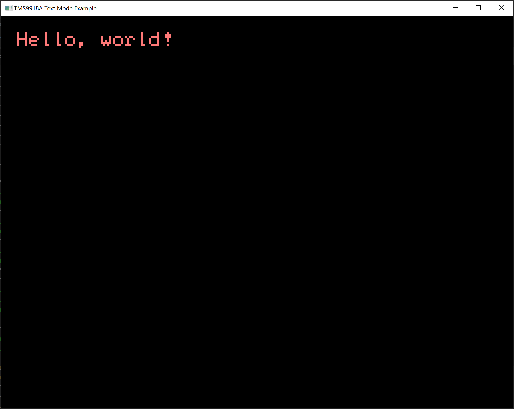

# tms9918a_emu
Texas Instruments TMS9918A VDP emulator library for Rust

[GitHub](https://github.com/ry755/tms9918a_emu) | [crates.io](https://crates.io/crates/tms9918a_emu) | [API Documentation](https://docs.rs/tms9918a_emu)

tms9918a_emu emulates a [Texas Instruments TMS9918A](https://en.wikipedia.org/wiki/Texas_Instruments_TMS9918) video display processor and provides a basic framebuffer as `Vec<u32>` which can be used with other creates, such as [minifb](https://github.com/emoon/rust_minifb), to create a window.

High-level functions are provided as well as low-level functions, making it easy to control the VDP without needing to use the control and data ports.

This emulator is a work-in-progress and currently only supports the Graphics I and Text video modes, and sprites are unsupported in all modes. In its current state, this emulator is more of a TMS9918 (non-A variant) emulator.

## Example
This is a small [example program](examples/high_level_text/src/main.rs) which uses Text mode to display a hello world message in a minifb window, showing how to use the high-level functions:

A similar [example program](examples/low_level_text/src/main.rs) is available which shows how to use the low-level functions to display the same hello world message.

## License

Licensed under either of

 * Apache License, Version 2.0
   ([LICENSE-APACHE](LICENSE-APACHE) or http://www.apache.org/licenses/LICENSE-2.0)
 * MIT license
   ([LICENSE-MIT](LICENSE-MIT) or http://opensource.org/licenses/MIT)

at your option.

## Contribution

Unless you explicitly state otherwise, any contribution intentionally submitted
for inclusion in the work by you, as defined in the Apache-2.0 license, shall be
dual licensed as above, without any additional terms or conditions.
